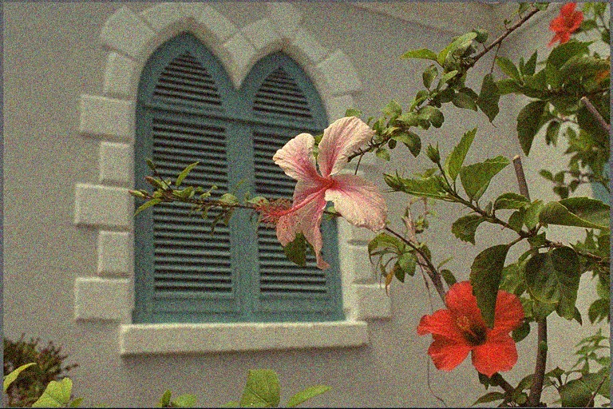

# RandomizedRedundantDCTDenoising

Project Page
------------
http://fukushima.web.nitech.ac.jp/research/rrdct/

Discription
-----------
The code demonstrates the paper [1].

In this paper, the DCT-based denoising [2] is accelerated by using a randomized algorithm.
The DCT is based on the fastest algorithm[3,4] and is SIMD vectorized by using SSE.
Some modifications improve denoising performance in term of PSNR.

The code is 100x faster than the OpenCV's implementation (cv::xphoto::dctDenoising) for the paper [2].
For color one megapixel image with Intel XEON X5690 3.47GHz (6 core+HT, dual CPU)
The code is tested on OpenCV 3.0 or later and Visual Studio 2013:
* OpenCV: (16 x 16) 9024 ms, (8 x 8) 5862 ms
* RRDCT : (16 x 16)   40.8 ms, (8 x 8) 39.2 ms

Optionally, we can use DHT (discrete Walsh–Hadamard transform) for fast computation instead of using DCT.

Download binary and Usage
-------------------------
https://github.com/norishigefukushima/RandomizedRedundantDCTDenoising/releases

Usage:
Denosing an image
* rrdct.exe kodim07s20.png out.png 20
* rrdct.exe -b=DCT -bs=16 -s=l kodim07s20.png out.png 20
GUI test mode
* rrdct.exe -g kodim07.png out.png
* key swich: 'n' switch for updating noise or not.

Help
* rrdct.exe -h

Reference
---------------------------
* [1] S. Fujita, N. Fukushima, M. Kimura, and Y. Ishibashi, "Randomized redundant DCT: Efficient denoising by using random subsampling of DCT patches," Proc. Siggraph Asia, Technical Brief, Nov. 2015.
* [2] G. Yu and G. Sapiro, "DCT image denoising: a simple and effective image denoising algorithm," Image Processing On Line, 1 (2011). http://dx.doi.org/10.5201/ipol.2011.ys-dct
http://www.ipol.im/pub/art/2011/ys-dct/
* [3] C. Loeffler, A. Ligtenberg, and G. S. Moschytz, "Practical fast 1-D DCT algorithms with 11 multiplications," Proc. Int'l. Conf. on Acoustics, Speech, and Signal Processing (ICASSP), pp. 988-991, 1989.
* [4] G. Plonka and M. Tasche. "Fast and numerically stable algorithms for discrete cosine transforms." Linear algebra and its applications, 394, pp. 309 - 345, 2005.

Result
------
* Computational time is 13.5 ms for 768 x 512 color image.
* d=3, bs=8 b=DCT

  
Input noisy image  

  
Denoised image

